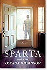
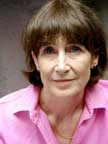

 Roxana Robinson is the author of five novels, including *Cost*; three collections of short stories; and the biography *Georgia O’Keeffe: A Life*. Her work has appeared in *The New Yorker*, *The Atlantic*, *Harper’s* Magazine, *The New York Times*, *The Washington Post*, *The Wall Street Journal*, *Travel and Leisure*, *More*, and *Vogue*, among other publications. She divides her time between New York, Connecticut, and Maine.  

[Full Bio](/biography/) 

[**Click here for hi-res images**](#downloads)

--- 

### Awards



---

### Downloads

---

[**](../assets/img/Roxana-ROBINSON-14David-Ignaszewski-koboy_LG.jpg "Cost Jacket Cover Roxana Robinson")

&nbsp;

### Sources

--- SPARTA Cover (6"X10" 72 ppi)

--- Roxana Robinson, credit ©2010 David Ignaszewski/Koboy (4"X6" 300ppi)

--- Roxana Robinson, credit ©2008 JoyceRavid (5X6.5 @ 300ppi)

--- Roxana Robinson, credit ©2008 JoyceRavid (5X6.5 @ 300ppi)

